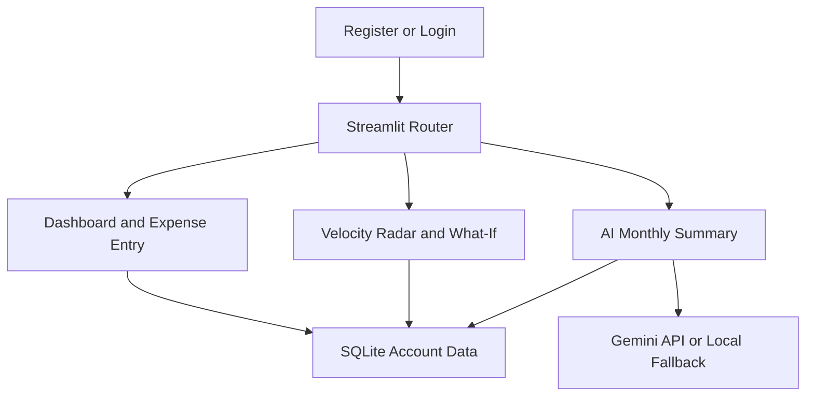

# CashCanvas

### A proactive expense tracker with visual analytics, spending forecasts, and smart monthly insights

[](https://www.python.org/)
[](https://streamlit.io/)
[](https://www.sqlite.org/)
[](https://ai.google.dev/)

CashCanvas is a Python-based expense tracker built for the Samsung Innovation Campus hackathon. It helps students, employees, parents, and other budget-conscious users record expenses, understand spending patterns through graphs, and receive early warnings when they are likely to exceed their monthly budget.

Unlike conventional expense trackers that only report past spending, CashCanvas uses an Exponentially Weighted Moving Average (EWMA) to measure spending velocity and forecast possible overspending before the month ends.

## Problem Statement

Students managing pocket money, employees tracking salaries, and parents handling household budgets often realize they have overspent only at the end of the month. Most expense trackers are retrospective: they record and visualize previous expenses but do not warn users early enough to change their behaviour.

CashCanvas addresses this problem through a login-protected expense dashboard, category and time-based graphs, an EWMA-powered Spending Velocity Radar, category-wise trend detection, a What-If simulator, and a plain-language monthly summary. The application turns expense tracking from a passive record-keeping activity into a proactive financial decision-support tool.

## Key Features

- **Secure registration and login:** Passwords are hashed using bcrypt.
- **Account-specific data:** Every transaction is linked to a `user_id`, preventing data from crossing between accounts.
- **Expense entry form:** Add an amount, predefined category, description, and date.
- **Normalized categories:** A fixed dropdown prevents duplicate categories such as `FOOD`, `Food`, and `food`.
- **Dashboard metrics:** View total spending, transaction count, average expense, and top category.
- **Recent expenses:** Review the latest transactions immediately after saving.
- **Category pie chart:** Compare the proportion spent in each category.
- **Monthly bar chart:** Compare total expenditure across months.
- **Cumulative spending chart:** Track how total spending grows over time.
- **Actual vs. EWMA chart:** Compare daily expenses with the smoothed spending trend.
- **Category-wise EWMA trends:** Classify categories as rapidly increasing, increasing, stable, or decreasing.
- **Smart trend insight:** Receive a warning, positive message, or neutral message based on recent spending behaviour.
- **Spending Velocity Radar:** Forecast month-end spending and compare it with the budget.
- **One-sigma confidence corridor:** Display a range around the projected cumulative expense.
- **What-If simulator:** Adjust future spending and see the forecast redraw immediately.
- **AI monthly summary:** Generate a short natural-language recap with the Gemini API.
- **Offline fallback:** If the API key or internet connection is unavailable, the application produces a rule-based summary instead of crashing.

## Application Flow



## Technology Stack

| Layer | Technology | Purpose |
|---|---|---|
| Programming language | Python | Implements the complete application |
| Web interface | Streamlit | Provides forms, navigation, metrics, tables, alerts, and live interaction |
| Data processing | Pandas | Cleans, groups, resamples, and aggregates transaction data |
| Statistical calculations | NumPy | Supports standard deviation, variance, and confidence calculations |
| Static visualizations | Matplotlib and Seaborn | Produce pie, bar, cumulative, and dual-line charts |
| Interactive visualization | Altair | Renders the multi-layer Spending Velocity Radar |
| Forecasting | EWMA | Estimates the recent daily spending rate with more weight on recent expenses |
| Simulation | Streamlit session state | Recalculates forecasts when the What-If input changes |
| Database | SQLite | Stores users, transactions, and monthly budgets locally |
| Authentication | bcrypt | Hashes and verifies account passwords |
| AI summary | Google Gemini API | Converts monthly statistics into a short natural-language recap |
| Configuration | python-dotenv | Loads API configuration from a local `.env` file |

## How the Forecasting Works

### EWMA spending velocity

The Exponentially Weighted Moving Average gives greater importance to recent expenses:

```text
EWMA(t) = alpha * Expense(t) + (1 - alpha) * EWMA(t - 1)
alpha   = 2 / (span + 1)
```

This makes the forecast react more quickly to recent spending spikes than a simple average.

### Month-end projection

```text
Projected month-end spending =
Current cumulative spending + (EWMA daily rate * remaining days)
```

If the projected month-end value exceeds the selected monthly budget, `will_overspend` becomes `True` and the user receives an early warning.

### Confidence corridor

CashCanvas calculates the rolling standard deviation of daily spending and displays a one-sigma upper and lower corridor around the projected cumulative value. The shaded band communicates forecast uncertainty without requiring an advanced forecasting library.

### Category trend classification

For every category, CashCanvas compares the recent half of a 14-day EWMA window with the earlier half.

| Percentage change | Classification | Symbol |
|---:|---|:---:|
| Greater than 25% | Rapid increase | ↑↑ |
| Greater than 5% | Increasing | ↑ |
| Between -5% and 5% | Stable | → |
| Less than -5% | Decreasing | ↓ |

## Project Structure

```text
cashcanvas/
├── app.py
├── README.md
├── requirements.txt
├── .env.example
├── .gitignore
├── auth/
│   ├── __init__.py
│   └── login.py
├── database/
│   ├── __init__.py
│   ├── db_setup.py
│   └── db_operations.py
├── modules/
│   ├── __init__.py
│   ├── visualizations.py
│   ├── forecasting.py
│   ├── altair_charts.py
│   ├── whatif_simulator.py
│   └── ai_summarizer.py
├── tests/
└── docs/
```

## Database Design

CashCanvas uses three SQLite tables:

| Table | Purpose |
|---|---|
| `users` | Stores account details and bcrypt password hashes |
| `transactions` | Stores user-specific expenses, categories, descriptions, and dates |
| `budgets` | Stores category/month-specific budget limits |

Every transaction and budget is linked to a user through `user_id`. Parameterized SQL queries are used instead of inserting user input directly into SQL statements.

## Installation

### Prerequisites

- Python 3.10 or later
- Git
- A Gemini API key, optional because an offline summary is available

### 1. Clone the repository

```powershell
git clone https://github.com/Abhidev2004/cashcanvas.git
cd cashcanvas
```

### 2. Create a virtual environment

Windows PowerShell:

```powershell
python -m venv venv
.\venv\Scripts\Activate.ps1
```

macOS or Linux:

```bash
python3 -m venv venv
source venv/bin/activate
```

### 3. Install dependencies

```powershell
python -m pip install --upgrade pip
python -m pip install -r requirements.txt
```

### 4. Create the environment file

Windows PowerShell:

```powershell
Copy-Item .env.example .env
```

macOS or Linux:

```bash
cp .env.example .env
```

The `.env` file should contain:

```env
GEMINI_API_KEY=your_key_here
GEMINI_MODEL=
```

Replace `your_key_here` with a valid API key if you want Gemini-generated summaries. Leave the placeholder unchanged to use the local rule-based fallback.

> [!IMPORTANT]
> Never commit `.env` or paste an API key directly into the Python source code.

Confirm that Git ignores the file:

```powershell
git check-ignore -v .env
```

### 5. Initialize the database

```powershell
python database/db_setup.py
```

Expected output:

```text
Database initialized successfully at: cashcanvas.db
```

The local database is generated automatically and is not committed to GitHub.

### 6. Start the application

```powershell
streamlit run app.py
```

Open the local address displayed by Streamlit, normally:

```text
http://localhost:8501
```

## How to Use CashCanvas

1. Register a new account with a unique username and email.
2. Log in using the registered username and password.
3. Open **Add Expense** from the sidebar.
4. Enter the amount, choose a category, add a description, and select a date.
5. Save the expense and return to the Dashboard automatically.
6. Review metrics, recent transactions, graphs, trend arrows, and the smart insight.
7. Open **Velocity Radar** to compare the projected month-end expense with the budget.
8. Move the **What-If** slider to simulate lower or higher future spending.
9. Open **AI Monthly Summary** to view the Gemini-generated or rule-based recap.
10. Use **Logout** to clear the current account session.

## Testing

### Syntax check

```powershell
python -m py_compile app.py auth/login.py database/db_setup.py database/db_operations.py modules/visualizations.py modules/forecasting.py modules/altair_charts.py modules/whatif_simulator.py modules/ai_summarizer.py
```

No output means the listed files contain valid Python syntax.

### Manual QA checklist

- Register two accounts and confirm their transactions never cross over.
- Add an expense and confirm it appears exactly once in Recent Expenses.
- Confirm existing values such as `FOOD` and `Food` appear as one canonical category.
- Test an empty account, a single transaction, multiple same-day transactions, and multiple dates.
- Set a small monthly budget and confirm `will_overspend` changes to `True`.
- Add a recent category spike and confirm the category displays `↑↑ Rapid increase`.
- Move the What-If slider to both extremes and confirm the forecast redraws.
- Temporarily unset `GEMINI_API_KEY` and confirm the rule-based summary appears without an exception.
- Clone the repository into a fresh folder and follow only this README to confirm the setup is complete.

## Security and Privacy

- Passwords are hashed with bcrypt before storage.
- Plain-text passwords are never written to SQLite.
- Queries use `user_id` to keep account data separated.
- SQL values are passed through parameterized queries.
- The Gemini API key is loaded from `.env` and excluded through `.gitignore`.
- `cashcanvas.db` remains local and is not committed to the repository.
- Login failures use a generic error message to avoid revealing whether a username exists.

## Design Goals

The project intentionally uses readable beginner-to-intermediate Python:

- Small, single-purpose functions
- Docstrings and inline comments
- Clear separation between UI, database, forecasting, visualizations, and AI logic
- Pandas and NumPy operations that can be explained during judging
- No unnecessary classes or advanced forecasting frameworks
- Graceful handling of empty data, unavailable APIs, and invalid input

## Future Improvements

- Edit and delete transactions
- Recurring expenses and reminders
- CSV import and export
- Downloadable monthly PDF reports
- Custom budget recommendations
- Cloud-hosted database support
- Mobile-friendly deployment
- Additional forecasting evaluation metrics

## Demo Sequence

For a short hackathon demonstration:

1. Register and log in with a new account.
2. Add expenses across several predefined categories.
3. Show the Dashboard metrics, graphs, recent expenses, and smart trend insight.
4. Highlight a category displaying `↑↑ Rapid increase`.
5. Open Velocity Radar and show the forecast crossing the budget line.
6. Move the What-If slider and show the forecast changing immediately.
7. Open AI Monthly Summary and read the generated recap.

---

Built as part of the **Samsung Innovation Campus Program Hackathon**.
